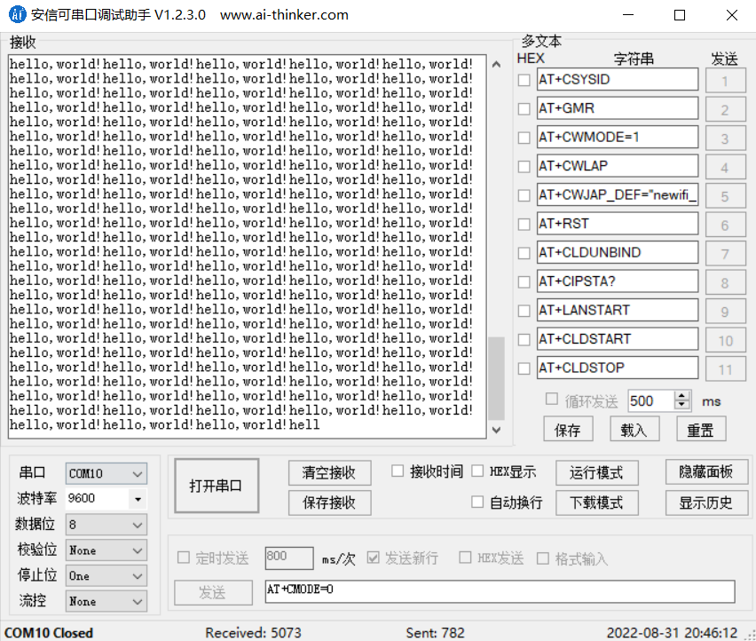

# 基于STM32CubeMX的HC-05蓝牙主从通讯 

开发板使用的是stm32f103c8t6，使用STM32CubeMX进行配置，实现两HC-05蓝牙之间主从通讯。

 HC-05蓝牙模块是主从一体的，两个HC-05之间一主一从通讯，要进入AT模式，对HC-05模块进行相应设置。

## 一、AT模式设置

- 首先HC-05蓝牙模块要通过TTL转USB模块连接到电脑，上电前**一直按住**HC-05上的按键，上电后松开按键，指示灯**慢闪**，表示进入**AT模式**；

**接线**：

| **HC-05** | **USB-TTL** |
| --------- | ----------- |
| VCC       | 5V          |
| GND       | GND         |
| TX        | RX          |
| RX        | TX          |


- 通过串口调试助手，**文本模式**，对HC-05进行AT设置，注意HC-05默认在**AT模式下波特率为38400**，**正常模式下波特率为9600**；

对从机(SLAVE) 依次输入一下AT指令：

| **指令**        | **功能**                                            |
| --------------- | --------------------------------------------------- |
| AT+ORGL         | 恢复出厂设置                                        |
| AT+NAME=BTSLAVE | 设置蓝牙名称                                        |
| AT+PSWD="1234"  | 设置连接密码1234，注意加英文双引号                  |
| AT+ROLE=0       | 0为从机模式                                         |
| AT+CMODE=0      | 连接模式为任意连接                                  |
| AT+ADDR?        | 查询mac地址，比如`0022:04:007407`，每个设备都不一样 |

对主机(MASTER) 依次输入一下AT指令：

| **指令**               | **功能**                               |
| ---------------------- | -------------------------------------- |
| AT+ORGL                | 恢复出厂设置                           |
| AT+NAME=BTMASTER       | 设置蓝牙名称                           |
| AT+PSWD=“1234”         | 这个就是从机的密码                     |
| AT+ROLE=1              | 1为主机模式                            |
| AT+CMODE=0             | 任意连接                               |
| AT+BIND=0022,04,007407 | 绑定从机地址，注意将从机地址`:`换成`,` |

注意指令必须为大写，每次恢复出厂设置后，指示灯会快闪，需拔下后重复第一步，重新进入AT模式。

完整指令集，可以自己到网上查资料。

完成配置后，主从两机重新上电，不需按按键，进入正常模式，这时HC-05指示灯快闪；等待几秒后，主从两机自动配对完成，同时间隔5秒闪烁，表示主从两机连接成功。

## 二、配置STM32

- 在STM32CubeMX中,对stm32进行配置


选择外部时钟


选择调试器


使能串口2


将波特率设为9600,与蓝牙波特率匹配


开启串口中断

## 三、测试

主函数循环中:

```C
uint8_t  SendBuffer[30]={"hello,world!"};
        HAL_UART_Transmit(&huart2, (uint8_t *)SendBuffer, sizeof(SendBuffer), HAL_MAX_DELAY);
```

串口助手接收数据:



通讯成功。

配置完成后，就可以忽略蓝牙，直接操作串口一样使用HC-05，还是十分简单方便的。

这个项目是疫情无法返校，家中备电赛的过程中完成的。参考结合了很多前人的经验，算是对整个过程的整合和总结。欢迎大家多多指教。